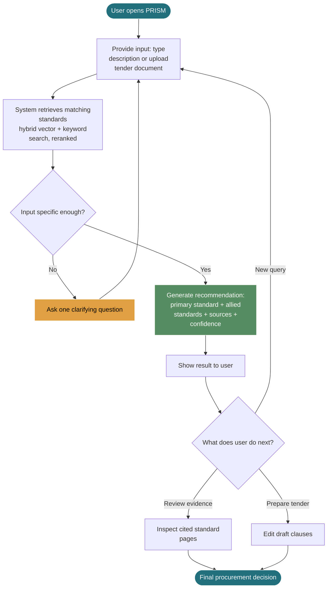

# PRISM Workflow and Architecture Diagrams

This document describes the current PRISM prototype. It separates the user-facing workflow from the software architecture and marks incomplete integrations explicitly.

## 1. User-Facing Workflow Diagram

The workflow covers both supported entry points: a typed product/specification query and an uploaded tender document.

### User interaction and system handoffs

1. The user supplies either a natural-language description or a tender document.
2. The frontend sends the request to the FastAPI backend.
3. The backend extracts and prepares the input when a document is uploaded.
4. The retrieval layer searches the local standards corpus using both semantic and keyword methods.
5. If the evidence is insufficient or ambiguous, PRISM pauses and asks one targeted question.
6. The user answers; the frontend resubmits the original input with the answer. The API is stateless between rounds.
7. Once the input is specific enough, PRISM produces a source-backed recommendation.
8. The user can inspect citations, allied standards, confidence information, GeM suggestions, and editable tender-draft material.
9. The user remains responsible for final procurement and legal/compliance validation.

## 2. Software Architecture Diagram

This diagram shows the current components and their connections. The BIS collector is implemented as a separate scheduled component, but its live handoff into the RAG/API path is not yet connected.

```mermaid
flowchart LR
    U[Procurement user]
    FE[React + Vite frontend\nSearch, upload, clarification, results]
    API[FastAPI backend\nmain.py\nCORS, API keys, rate limiting, routes]

    REC[Recommendation service\nrecommend.py\nconfidence, safeguards, response model]
    DOC[Document extraction\ndocuments.py, pdf_extract.py\nPDF/DOCX/TXT/MD and OCR]
    RET[Hybrid retriever\nretriever.py\nChroma + BM25 + RRF + reranker]
    LLM[Groq LLM\ngrounded JSON recommendation]
    REF[Reference graph services\nreference_extract.py, references.py]
    CLAR[Clarification service\nclarify.py\npart, role, product questions]
    GEM[GeM integration\ngem/catalog.py, search.py, suggest.py]
    TENDER[Tender draft builder\ntender.py\neditable clauses and placeholders]

    CHROMA[(Chroma vector store\nprism_standards)]
    BM25[(BM25 index\nbm25_index.pkl)]
    CORPUS[(Local BIS PDF corpus\nrag/backend/data)]
    CATALOG[(Standards catalog\nstandards_catalog.json)]
    GRAPH[(Reference graph\nreference_graph.json)]
    OCR[(OCR cache and\ningestion reports)]
    GEMDATA[(GeM snapshot/cache\ngem_categories.csv, gem_cache)]

    BIS[Scheduled BIS collector\nchange_detector.py + scheduler.py]
    DISC[Page hashing and discovery\npage_hasher.py, discovery.py]
    SCRAPE[Selenium legacy scraper\nscraper_adapter.py]
    PARSE[Artifact parser and fingerprints\nartifact_parser.py, fingerprint.py]
    SQLITE[(SQLite BIS monitor database\nstandards, crawl_runs,\nstandard_delta_log)]
    ALERT[Change records\nnew, updated, withdrawn\nUser notification delivery: not implemented]

    U --> FE
    FE -->|POST /api/recommend| API
    FE -->|POST /api/recommend/upload| API
    FE -->|answers, asked dimensions| API
    API --> DOC
    API --> REC
    REC --> CLAR
    REC --> RET
    REC --> LLM
    REC --> REF
    REC --> GEM
    REC --> TENDER

    DOC --> RET
    RET --> CHROMA
    RET --> BM25
    RET --> CATALOG
    RET --> CORPUS
    REF --> GRAPH
    GEM --> GEMDATA
    TENDER --> REF

    BIS --> DISC
    DISC -->|changed/new standard IDs| SCRAPE
    SCRAPE --> PARSE
    PARSE --> SQLITE
    BIS --> SQLITE
    SQLITE --> ALERT

    CORPUS -. local/manual ingestion path .-> CHROMA
    CATALOG -. catalog build and ingestion metadata .-> CHROMA
    SQLITE -. intended data-boundary handoff; currently not connected .-> CATALOG
    ALERT -. future notification service .-> FE

    classDef user fill:#1f6f8b,color:#fff
    classDef service fill:#4f8a5b,color:#fff
    classDef store fill:#6c757d,color:#fff
    classDef incomplete fill:#f0ad4e,color:#111

    class U user
    class FE,API,REC,DOC,RET,LLM,REF,CLAR,GEM,TENDER,BIS,DISC,SCRAPE,PARSE service
    class CHROMA,BM25,CORPUS,CATALOG,GRAPH,OCR,GEMDATA,SQLITE store
    class ALERT incomplete
```

### Component responsibilities

| Component | Responsibility |
|---|---|
| React/Vite frontend | Collects user input, supports document upload, displays clarification questions and structured results. |
| FastAPI backend | Exposes recommendation, upload, reference-chain, health, and protected ingestion routes. |
| Document extraction | Extracts text from supported uploads and uses page-level OCR for scanned PDFs. |
| Hybrid retriever | Combines vector retrieval, BM25 search, reciprocal-rank fusion, and cross-encoder reranking. |
| Recommendation service | Chooses from retrieved candidates, applies confidence safeguards, assembles the response, and prevents unsupported certification claims. |
| Clarification service | Identifies ambiguity around standard part, document role, or product and asks a targeted question. |
| Reference graph | Represents standard-to-standard citations, roles, pages, confidence, and whether the target is in the local corpus. |
| GeM integration | Matches recommendations to a local GeM catalogue and optionally verifies against live GeM results when enabled. |
| Tender draft builder | Produces editable, evidence-aware draft clauses with explicit placeholders. |
| Chroma and BM25 | Store and search the locally indexed standards corpus. |
| Standards catalog | Maps files to standard IDs, titles, editions, and related metadata. It is a draft and requires review. |
| BIS collector | Periodically monitors BIS pages, discovers changed standards, downloads artifacts, parses metadata, and records deltas. |
| SQLite monitor database | Stores BIS monitor state, crawl runs, current standard metadata, and change history. |

### Current limitations represented in the architecture

- BIS collector output is not yet automatically re-indexed into the RAG engine.
- Live standard status, amendments, and withdrawals are therefore not guaranteed in recommendation responses.
- Redis caching is not present; rate limiting is in-memory and local caches are file-based.
- PostgreSQL is not used; BIS monitoring uses SQLite and retrieval uses Chroma/local files.
- Translation and verified support for 22 scheduled languages are not implemented.
- Certification reasoning for BIS Product Certification, CRS, and Hallmarking is not implemented.
- MSE and Make-in-India purchase-preference reasoning is not implemented.
- User notification delivery for BIS changes is not implemented; only change records are persisted.
``